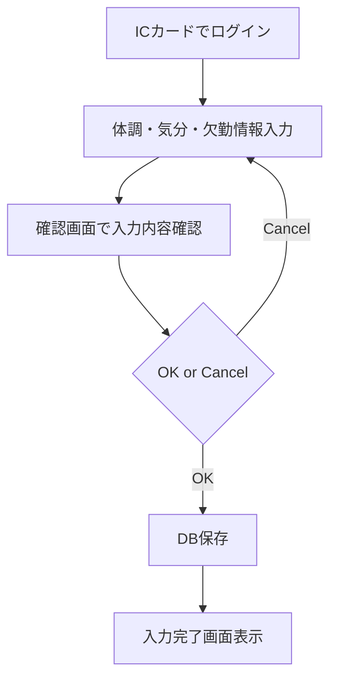
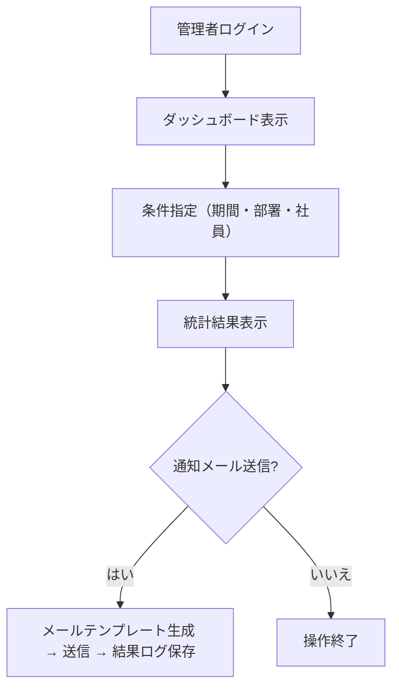

# 社員体調管理システム 基本設計書

## 1. 概要
社員の体調および気分を日次で記録・集計し、体調不良やメンタル不調の兆候を早期に把握・サポートすることを目的としたWebシステム。  
将来的には出社時のタッチパネル入力やIDカード認証との連携も想定する。

---

## 2. 開発目的
- 社員の健康状態を日々可視化し、心身の不調を早期発見する。  
- 管理者が統計データを基に全体の傾向を把握できるようにする。  
- 継続的な健康支援・フォロー体制の構築を支援する。

---

## 3. 想定利用者
| 区分 | 役割 | 主な利用内容 |
|------|------|---------------|
| 一般社員 | 自身の体調・気分を入力 | 出社時に体調・気分をアイコンで選択 |
| 管理者 | 全社員のデータを閲覧・分析 | グラフ表示、集計、アラート確認 |
| サポート担当 | 健康サポート通知の実施 | 不調傾向者へのメール通知など |

---

## 4. 利用シーン
- 出社後、入口付近のタッチパネル端末やPCでログイン  
- 体調（肉体的）と気分（精神的）をそれぞれ5段階評価で入力  
- 入力結果は即時DBへ保存  
- 管理者はWebダッシュボード上でデータ集計結果を確認  
- 欠勤・休暇情報も入力・記録可能  
- 将来的には退勤時入力や勤怠管理データとの連携も可能な構造

---

## 5. 機能要件

### 5.1 一般社員機能
- ログイン（ICカードUID認証）
- 体調・気分の入力（5段階評価、肉体的/精神的別）
- 入力は1日1回、上書き不可
- 入力時に確認画面を表示して誤入力防止
- 欠勤・休暇情報も登録可能
- 入力履歴の確認（任意）

### 5.2 管理者機能
- 社員全体・部署単位での体調・気分統計表示
- グラフ・表形式での可視化（期間フィルタ、平均値など）
- 体調・気分が一定期間低下している社員の抽出
- サポート通知メール送信機能

### 5.3 拡張機能（将来的実装）
- 退勤時入力追加
- 勤怠管理データとの連携（出社/退勤時間のCSV取込想定）
- 多要素認証（カード＋PIN、パスワード）や顔認証など

---

## 6. 非機能要件
| 項目 | 要件内容 |
|------|-----------|
| パフォーマンス | 日次入力・集計をスムーズに行えるレスポンス（1秒以内目安） |
| セキュリティ | ICカード認証必須、社員データの暗号化保存(Django標準の認証・暗号化（パスワードハッシュ、HTTPS）) |
| 拡張性 | 外部API・ファイル連携（CSV、Excel等）もDjangoの機能で対応可能 |
| 保守性 | DjangoはMVC(MTV)構造なので、「ロジック層（views/models）とUI層（templates/JS）を分離」 |

---

## 7. 使用技術（想定）
| 区分 | 技術・ツール | 用途 |
|------|----------------|------|
| フロントエンド | HTML / CSS / JavaScript | 入力画面・グラフ表示 |
| バックエンド | Python（Django） | サーバ処理・集計 |
| データベース | SQLiteは学習・開発用、MySQL/PostgreSQLは本番用 | 体調・気分・社員情報管理 |
| その他 | Django ORM、CSV連携、メール送信API | 集計・通知処理 |

---

## 9. 画面構成案

### 9.1 一般社員向け画面
| 画面名 | 概要 | 主な要素 | 入力/出力 |
|--------|------|-----------|-----------|
| ログイン画面 | ICカードUIDで認証 | カードリーダー入力欄、ログインボタン | 入力：ICカードUID<br>出力：認証結果 |
| 体調入力画面 | 体調・気分・欠勤入力 | 肉体的・精神的評価アイコン（1〜5）、欠勤チェック、確認ボタン | 入力：評価値、欠勤フラグ<br>出力：確認画面遷移 |
| 確認画面 | 入力内容確認 | 入力内容表示、OK/キャンセルボタン | 入力：なし<br>出力：DB保存または入力画面へ戻る |
| 入力完了画面 | 保存結果表示 | 完了メッセージ、戻るボタン | 入力：なし<br>出力：完了メッセージ |

### 9.2 管理者向け画面
| 画面名 | 概要 | 主な要素 | 入力/出力 |
|--------|------|-----------|-----------|
| ダッシュボード | 全社員統計表示 | グラフ（体調・気分）、表（最新入力、欠勤情報）、通知ボタン | 入力：期間選択、通知対象選択<br>出力：統計グラフ、メール送信 |
| 詳細社員画面 | 個別社員データ確認 | 入力履歴表、過去の統計グラフ | 入力：社員選択<br>出力：履歴表示、分析結果 |

---

## 10. 処理フロー図（簡易）

### 10.1 一般社員入力フロー
```text
[ICカード認証] --> [認証成功?]
        | No -> [エラー表示]
        | Yes
        v
  [入力画面表示]
        |
        v
 [体調/気分入力] --> [欠勤フラグチェック]
        |
        v
   [確認画面]
        |
   +----+----+
   |         |
  OK       Cancel
   |         |
   v         v
[DB保存]   [入力画面戻る]
   |
   v
[入力完了画面]
```
### 10.2 管理者集計フロー
```text
[管理者ログイン]
        |
        v
 [ダッシュボード表示]
        |
        v
[期間/部署選択] --> [統計集計]
        |
        v
 [グラフ/表表示]
        |
        +--> [通知メール送信] --> [完了表示]
```

---

## 11. 拡張性設計ポイント

### 11.1 退勤入力対応
- 入力画面を拡張し「退勤時体調/気分」ボタンを追加
- `condition_records` に退勤スコア用カラムを追加

### 11.2 勤怠連携
- 出社/退勤時刻を `attendance` テーブルに登録
- 体調入力と結び付けて統計可能

### 11.3 多要素認証
- ログインモジュール分離（`auth/password_auth.py`、`auth/card_auth.py`）
- 将来的に切り替え可能

### 11.4 UI/UX改善
- タッチパネル対応（大きめボタン、確認ダイアログ）
- モバイル表示やレスポンシブ対応を後付け可能

---

## 12. 統計処理・通知フロー

### 12.1 統計処理フロー
1. DBから条件に沿ったデータを取得  
   - 期間：1週間、1ヶ月、3ヶ月  
   - 対象：個人、部署、全体
2. 欠勤・休暇情報も含めて集計
3. 体調・気分の平均値、分布を算出
4. 連続して低評価（例：1〜2点）の社員を抽出
5. 集計結果を管理者用ダッシュボードに表示  
   - 棒グラフ、折れ線グラフ、表形式
6. 必要に応じて通知対象リストを生成

### 12.2 通知処理フロー
1. 統計処理で低評価社員を抽出
2. 通知対象リスト作成
3. メールテンプレート生成
4. メール送信API呼び出し
5. 送信結果確認・ログ保存

**補足**
- 通知対象は管理者がダッシュボードで確認・手動送信も可能
- 将来的に自動送信スケジュールも追加可能
- メール内容はテンプレート化し、個人情報は安全に取り扱う

### 12.3 拡張性ポイント
- 勤怠データと結び付けて「勤務時間と体調の相関分析」も可能
- 複数条件（部署別、役職別、欠勤回数等）での抽出も容易
- 通知はメールだけでなく Slack や Teams への通知にも対応可能

---

## 13. 画面構成・操作フロー

### 13.1 一般社員向け画面

#### ログイン画面
- ICカードUIDで認証  
- カードリーダー入力欄、ログインボタン

#### 体調入力画面
- 体調（肉体的）・気分（精神的）評価アイコン（1〜5段階）
- 欠勤チェックボックス
- 確認ボタン

#### 確認画面
- 入力内容表示
- OK/キャンセルボタン
- OKでDB保存、Cancelで入力画面に戻る

#### 入力完了画面
- 完了メッセージ表示
- 戻るボタン

### 13.2 管理者向け画面

#### ダッシュボード画面
- 全社員統計表示
- グラフ（体調・気分）、表（最新入力・欠勤情報）、通知ボタン
- 期間や部署でフィルタ可能

#### 詳細社員画面
- 個別社員の入力履歴表示
- 過去の統計グラフ表示
- 分析結果確認可能

### 13.3 操作フロー（例）

#### 一般社員
1. ICカードでログイン  
2. 体調・気分・欠勤情報入力  
3. 確認画面で入力内容を確認  
4. OKでDB保存 → 入力完了画面


#### 管理者
1. 管理者ログイン  
2. ダッシュボード表示  
3. 条件指定（期間・部署・社員）  
4. 統計結果表示
5. 必要に応じて通知メール送信



---

## 14. データベース設計


### 14.1 テーブル一覧
1. **employees**（社員情報）
2. **condition_records**（体調・気分記録）
3. **attendance**（勤怠情報）
4. **notifications**（通知履歴）

### 14.2 テーブル詳細

### 14.2.1 employees（社員情報）

| カラム名          | 型        | 制約              | 説明               |
| ------------- | -------- | --------------- | ---------------- |
| id            | INT      | PK, 自動採番        | 社員ID（Django自動生成） |
| name          | VARCHAR  | NOT NULL        | 社員名              |
| age           | INT      | NOT NULL, INDEX | 年齢（統計用に検索頻度高め）   |
| gender        | CHAR(1)  | NOT NULL        | 性別（M:男性, F:女性）   |
| department    | VARCHAR  | INDEX           | 部署名              |
| position      | VARCHAR  |                 | 役職               |
| card_uid      | VARCHAR  | UNIQUE          | ICカードUID         |
| password_hash | VARCHAR  | NULL許容          | 将来利用（ハッシュ保存）     |
| is_active     | BOOLEAN  | NOT NULL        | 有効/無効            |
| created_at    | DATETIME | NOT NULL        | 登録日時             |
| updated_at    | DATETIME | NOT NULL        | 更新日時             |


**補足**
- Djangoモデルにするとコードは下記のようになる

```py
class Employee(models.Model):
    name = models.CharField(max_length=50)
    age = models.PositiveIntegerField(db_index=True)
    gender = models.CharField(max_length=1, choices=[('M','Male'),('F','Female')])
    department = models.CharField(max_length=50, db_index=True)
    position = models.CharField(max_length=5)
    card_uid = models.CharField(max_length=20, unique=True)
    password_hash = models.CharField(max_length=255, null=True, blank=True)
    is_active = models.BooleanField(default=True)
    created_at = models.DateTimeField(auto_now_add=True)
    updated_at = models.DateTimeField(auto_now=True)
```

### 14.2.2 condition_records（体調・気分記録）

| カラム名           | 型          | 制約                                         | 説明              |
| -------------- | ---------- | ------------------------------------------ | --------------- |
| record_id      | INT        | PRIMARY KEY, AUTO_INCREMENT                | 記録ID（自動採番）      |
| employee       | ForeignKey | NOT NULL, employeesテーブル参照                  | 社員ID            |
| date           | DATE       | NOT NULL                                   | 記録日             |
| physical_score | TINYINT    | NOT NULL, CHECK (1 <= physical_score <= 5) | 体調スコア（1〜5）      |
| mental_score   | TINYINT    | NOT NULL, CHECK (1 <= mental_score <= 5)   | 気分スコア（1〜5）      |
| is_absent      | BOOLEAN    | NOT NULL                                   | 欠勤フラグ           |
| remarks        | TEXT       | NULL許容                                     | 備考（拡張性優先でTEXT型） |
| created_at     | DATETIME   | auto_now_add=True                          | レコード作成日時        |
| updated_at     | DATETIME   | auto_now=True                              | レコード更新日時        |

**補足**
- Djangoモデルにするとコードは下記のようになる

```py
from django.db import models

class ConditionRecord(models.Model):
    employee = models.ForeignKey(
        'Employee', on_delete=models.CASCADE, related_name='condition_records'
    )
    date = models.DateField()
    physical_score = models.PositiveSmallIntegerField()
    mental_score = models.PositiveSmallIntegerField()
    is_absent = models.BooleanField(default=False)
    remarks = models.TextField(blank=True, null=True)
    created_at = models.DateTimeField(auto_now_add=True)
    updated_at = models.DateTimeField(auto_now=True)

    class Meta:
        db_table = 'condition_records'
        ordering = ['-date']
        constraints = [
            models.CheckConstraint(
                check=models.Q(physical_score__gte=1, physical_score__lte=5),
                name='physical_score_range'
            ),
            models.CheckConstraint(
                check=models.Q(mental_score__gte=1, mental_score__lte=5),
                name='mental_score_range'
            ),
        ]

    def __str__(self):
        return f"{self.employee.name} - {self.date}"
```

### 14.2.3 attendance（勤怠情報）

| カラム名           | 型          | 制約                          | 説明                  |
| -------------- | ---------- | --------------------------- | ------------------- |
| attendance_id  | INT        | PRIMARY KEY, AUTO_INCREMENT | 勤怠ID（自動採番）          |
| employee       | ForeignKey | NOT NULL, employeesテーブル参照   | 社員ID                |
| date           | DATE       | NOT NULL                    | 勤怠日                 |
| check_in_time  | TIME       | NOT NULL                    | 出社時刻                |
| check_out_time | TIME       | NULL許容                      | 退勤時刻（将来拡張用）         |
| work_hours     | DECIMAL    | NULL許容                      | 勤務時間（退勤時間が入った場合に計算） |
| created_at     | DATETIME   | auto_now_add=True           | レコード作成日時            |
| updated_at     | DATETIME   | auto_now=True               | レコード更新日時            |


**補足**
- Djangoモデルにするとコードは下記のようになる
- unique_together で 1日1レコード保証
- work_hours は退勤時間が入力されるまで NULL 可
- related_name で employee.attendances.all() のように逆参照可能

```py
from django.db import models

class Attendance(models.Model):
    employee = models.ForeignKey(
        'Employee', on_delete=models.CASCADE, related_name='attendances'
    )
    date = models.DateField()
    check_in_time = models.TimeField()
    check_out_time = models.TimeField(blank=True, null=True)
    work_hours = models.DecimalField(max_digits=5, decimal_places=2, blank=True, null=True)
    created_at = models.DateTimeField(auto_now_add=True)
    updated_at = models.DateTimeField(auto_now=True)

    class Meta:
        db_table = 'attendance'
        ordering = ['-date']
        unique_together = ('employee', 'date')  # 1日1レコード保証

    def __str__(self):
        return f"{self.employee.name} - {self.date}"
```

### 14.2.4 notifications（通知履歴）

| カラム名            | 型           | 制約                          | 説明                 |
| --------------- | ----------- | --------------------------- | ------------------ |
| notification_id | INT         | PRIMARY KEY, AUTO_INCREMENT | 通知ID（自動採番）         |
| employee        | ForeignKey  | NOT NULL, employeesテーブル参照   | 対象社員ID             |
| date            | DATETIME    | NOT NULL                    | 通知日時               |
| type            | VARCHAR(50) | NOT NULL                    | 通知タイプ（メール、Slackなど） |
| content         | TEXT        | NOT NULL                    | 通知内容               |
| status          | VARCHAR(20) | NOT NULL                    | 送信結果（送信済み、失敗など）    |
| created_at      | DATETIME    | auto_now_add=True           | レコード作成日時           |
| updated_at      | DATETIME    | auto_now=True               | レコード更新日時           |

**補足**
- Djangoモデルにするとコードは下記のようになる
- employee で対象社員と紐付け
- status で送信結果を管理（失敗・成功など）
- ordering で最新通知が上に表示される
- 将来的に Slack や Teams など複数通知タイプにも対応可能
  
```py
from django.db import models

class Notification(models.Model):
    employee = models.ForeignKey(
        'Employee', on_delete=models.CASCADE, related_name='notifications'
    )
    date = models.DateTimeField()
    type = models.CharField(max_length=50)
    content = models.TextField()
    status = models.CharField(max_length=20)
    created_at = models.DateTimeField(auto_now_add=True)
    updated_at = models.DateTimeField(auto_now=True)

    class Meta:
        db_table = 'notifications'
        ordering = ['-date']

    def __str__(self):
        return f"{self.type} - {self.employee.name} - {self.date}"
```

---

## 15. 統計処理・通知処理設計

### 15.1 統計処理フロー
1. DBから条件に沿ったデータを取得
   - 期間：1週間、1ヶ月、3ヶ月
   - 対象：個人、部署、全体
2. 欠勤・休暇情報も含めて集計
3. 体調・気分の平均値、分布を算出
4. 連続して低評価（例：1〜2点）の社員を抽出
5. 集計結果を管理者用ダッシュボードに表示
   - 棒グラフ、折れ線グラフ、表形式
6. 必要に応じて通知対象リストを生成

### 15.2 通知処理フロー
1. 統計処理で低評価社員を抽出
2. 通知対象リスト作成
3. メールテンプレート生成
4. メール送信API呼び出し
5. 送信結果確認・ログ保存

### 15.3 補足設計
- 通知対象は管理者がダッシュボードで確認・手動送信も可能
- 将来的に自動送信スケジュールも追加可能
- メール内容はテンプレート化し、個人情報は安全に取り扱う
- 勤怠データと結び付けて「勤務時間と体調の相関分析」も可能
- 複数条件（部署別、役職別、欠勤回数等）での抽出も容易
- 通知はメールだけでなくSlackやTeamsへの通知にも対応可能

---


## xx. 更新履歴

| 日付       | 内容                                   |
|:----------:|:------------------------------------:|
| 2025-10-15 | 初版作成（要求仕様・基本設計統合版） |
